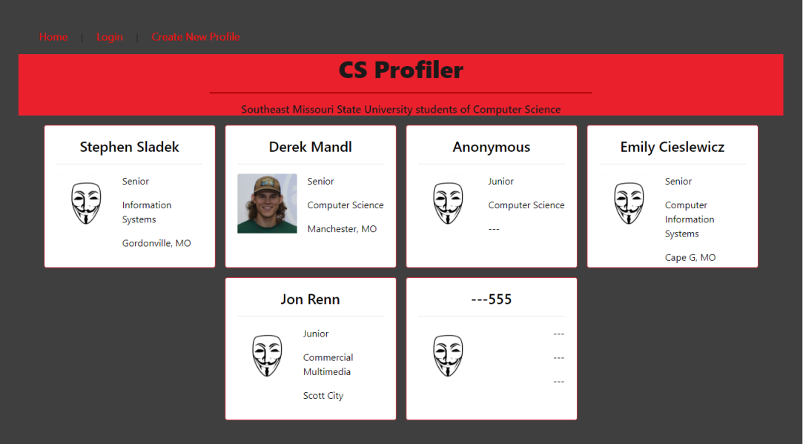
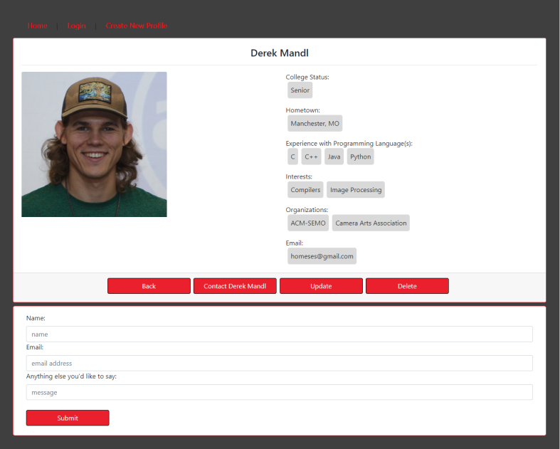
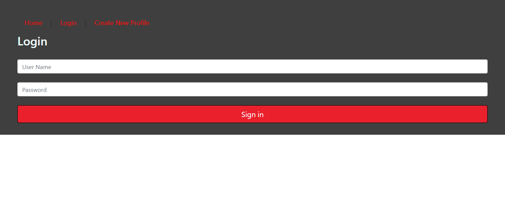
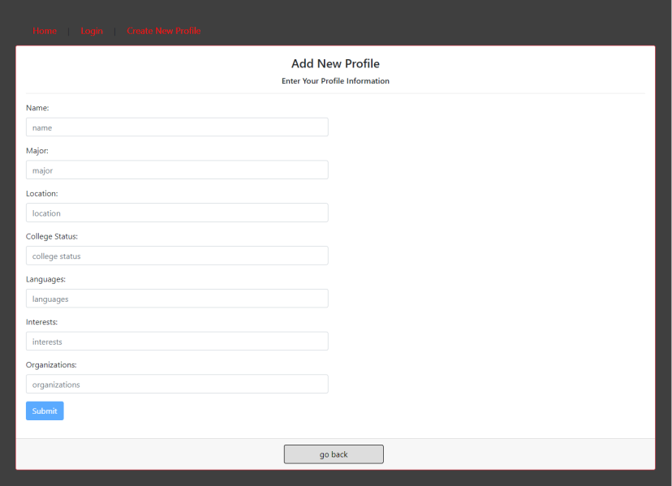
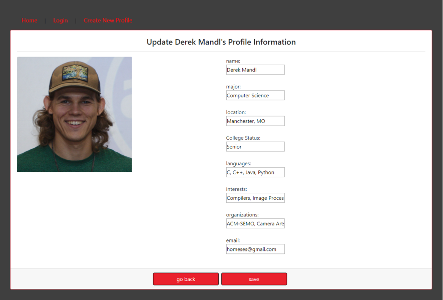

# CS-Profile
### by Derek Mandl, Simone Ruffin, and Stephen Sladek

##### Home Menu

### Purpose
This is a prototype profiler for CS students at SEMO. The purpose of this project is for learning Angular
and for presenting a project for the CS483: Advanced Web Development course.

### Requirements of the project

#### Part 1
- Phase 1: Break your design into a couple of components and make all of the components work together for your website. 
- Phase 2: Add Angular services and routing into your phase 1 website design, make your components consuming the services and website navigation through routing.  
- Phase 3: Add in-memory web api to simulate a data server.  Make your phase 2 services consume in-memory data from server, and then components consume the services. 

#### Part 2
- Phase 1: Move the in-memory web api part to back-end using C# asp.net core web api. Then your angular front-end needs to call the api from the newly created back-end.    
- Phase 2: Modify phase 1 back-end to use Entity Framework for web api and test if your phase 1 front-end can communicate with the newly created back-end.
- Phase 3: Add authentication to both front-end and back-end. 

#### Part 3
- Enhance the existing project by adding additional functionality.

The backend of this project can be found here: [github.com/SEMO-Sulky-Penguins/CS-Profile-Backend](https://github.com/SEMO-Sulky-Penguins/CS-Profile-Backend)

### Functionalities
The functionalities of this project include a full CRUD implementation, JWT authentication, and the ability to send emails. The user can view profiles and send emails via the contact button by just visiting the website. Being able to add, update, and delete profiles requires a login though. We utilise a C# and .NET Core 2.1 backend to handle authentication. Our system uses EntityFramework to construct a SQL database automatically. Our profile information is also stored using said database.

##### Details

##### Login

##### Add a Profile

##### Update a Profile

### Setting up an Angular Project
- Make sure you have npm installed before starting: `npm -v`
- Install angular: `npm install -g @angular/cli`
	- You may need to add npm to your PATH. 
	- Adding %AppData%\npm to the environment variables worked for me.
- Create a new project: `ng new cs-profile`
- Install dependencies: `npm install angular-in-memory-web-api --save`
- When you're ready to run the app: `ng serve -o`
